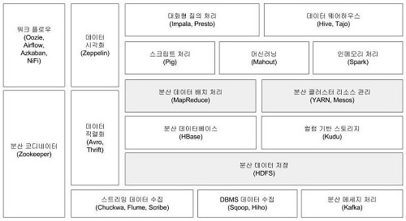
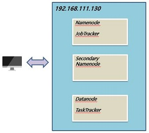
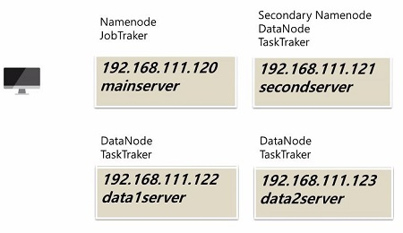

# Hadoop

> 참고 - 시작하세요! 하둡 프로그래밍(위키북스) 참고

### 빅데이터

- 수만 테라바이트 데이터.

- 다양한 종류의 대규모 데이터로부터 저렴한 비용으로 가치를 추출하고 데이터의 빠른 수집, 발굴, 분석하는 것.

### 빅데이터 3대 요소(3V)

- 크기(Volume) : 빅데이터의 크기는 수만 테라 데이터를 의미
- 속도(Velocity) : 다양한 데이터의 빠른 수집 및 저장, 처리, 분석을 의미
- 다양성(Variety) : 다양한 형태의 데이터 및 다양한 디바이스에서의 데이터로 구성

### 하둡

- 대용향 데이터를 분산 처리할 수 있는 자바 기반의 오픈소스 프레임워크
- 대형 서버 기반이 아닌 인텔 기반의 리눅스 서버에서 구동
- 분산 파일 시스템(HDFS)에 데이터를 저장하고 분산 처리 시스템인 맵리듀스를 이용해 데이터를 처리
- 하둡은 배치성으로 데이터를 저장하거나 처리하는데 적합한 시스템으로 구성
- 하둡은 RDBMS에 속하지는 않지만 NoSQL의 핵심 기능인 데이터베이스 시스템의 역할을 수행하는 것은 아님.
  - NoSQL (예) MongoDB)
    - 관계형 데이터 모델과 SQL문을 사용하지 않는 데이터베이스 시스템 혹은 데이터 저장소를 의미.
    - 키와 값의 쌍으로만 이루어짐.
    - 기존 RDBMS처럼 완벽한 데이터 무결성과 정합성을 제공하지 않음. 
    - 핵심은 아니지만 데이터를 보관하고 처리해야 하는 경우에 사용. 예) 트위터
- 장점 
  - 데이터 저장 용량이 부족할 경우 필요한 만큼 리눅스 서버만 추가하면 됨. 
  - 데이터의 복제본을 저장하기 때문에 데이터의 유실이나 장애가 발생했을 때 데이터 복구가 가능.
  - 여러 대의 서버에 데이터를 저장하고 데이터가 저장된 각 서버에서 동시에 데이터를 처리
  - 실시간 처리
- 문제점
  - 고가용성 지원 : 시스템 장애 발생 후 정상으로 돌아오는 것이 안되었으나 최근엔 지원.
  - 파일 네임스페이스 제한 : 네임노드가 고나리하는 메타 정보는 메모리로 관리되기 때문에 메모리의 용량에 따라 HDFS에 저장하는 파일과 디렉터리 개수가 제한을 받음.
  - 데이터 수정 불가 : 하둡의 또 다른 단점은 한 번 저장한 파일은 더는 수정할 수 없다는 것.
  - POSIX 명령어 미지원 : 기존 파일 시스템에서 사용하던 rm, mv 같은 POSIX 형식의 파일 명령어를 이용할 수 없음.
  - 전문 업체 부족 : 국내에는 하둡과 관련된 다양한 업체가 부족.

### 하둡 에코시스템 (p32)

 

### 하둡 실행모드

- 독립 실행 : 하둡의 기본 실행 모드. 하둡 환경설정 파일에 아무런 설정을 안 하므로 로컬 장비에서만 실행되는 로컬 모드. 하둡에서 제공하는 데몬을 구동하지 않기 때문에 분산 환경을 고려한 테스트는 불가능하고 단순히 맵리듀스 프로그램을 개발하거나 디버깅하는 용도로에만 적합한 모드.

- 가상 분산 : 하나의 장비에 모든 하둡 환경설정을 하고, 하둡 서비스도 이 장비에서만 제공하는 방식.

   

- 완전 분산 : 여러 대의 장비에 하둡이 설치된 경우. 하둡으로 라이브 서비스를 하게 될 경우 이와 같은 방식으로 구성.

    

