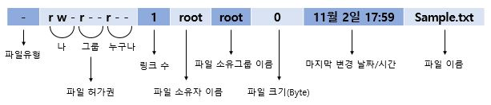
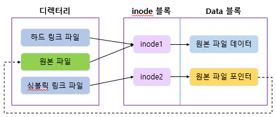

# Linux

> 사용한 리눅스 버전 : 15.5.1
>
> 책 - 이것이 리눅스다 with RedHat CentOS 8 (한빛미디어) 참고

### 리눅스를 쓰는 이유 

- 무료 서버
- 저렴한 os에도 설치가 가능
- 은행이나 대기업에서는 유지보수를 직접해야 하므로 리눅스를 안 씀
- 많은 서버를 설치하는 비용 문제로 빅테이터, 클라우스 환경에서는 리눅스가 부상
- 리눅스는 유닉스와 완벽하게 호환 가능
- 강력한 보안 기능, 서버 OS로 적합
- 다중 사용자, 다중 작업(멀티 태스킹), 다중 스레드를 지원하는 네트워크 OS
- 커널, 쉘 등의 다양한 기능 지원

### 리눅스의 단점

- 문제점 발생 시 보상받을 수 없음
- 한글 입출력 불편
- 사용자의 숙련된 기술 요구

### 리눅스 설치

> CentOS-7-x86_64-DVD-2003, vmnetcfg_15_5_1 다운로드

1. Vmware(가상 서버) 설치

- vmware가 설치된 폴더에 vmnetcfg(virtual network editor) 파일을 관리자 권한으로 넣어둔다.

  - virtual network editor는 컴퓨터를 껐다 킬 때마다 가상머신에서 바뀌는 ip주소를 고정 시킨다.

2. 가상 머신 설치

- Create a New Virtual Machie 실행 후 CentOS 삽입
- 가상 머신을 설치할 폴더 지정(C:\LINUX)
- Maximum disk size : 가상 하드디스크의 용량 지정(처음부터 이 만큼의 용량을 차지하는 것은 아님)

3. 가상 머신 설정

- Memory(=RAM) : 호스트 컴퓨터가 가진 메모리를 가상머신과 나눠 갖게 하는 부분을 설정
- Processors(=CPU) : 호스트 컴퓨터의 CPU가 멀티코어(2개 이상의 CPU)라면 가상머신에도 여러 개 할당이 가능
- Hard Disk(=NVMe) : 하드디스크를 탈부착 가능
  - SCSI(스카시) 방식 : 하드디스크 10개 이상씩 붙일 수 있으며 컴퓨터와 주변 장치를 연결하는 고속 인터페이스
  - IDE 방식 : 우리가 쓰는 컴퓨터방식
4. CentOS 설치 (p74 참고)

- 시간 및 날짜 : 지역 - 아시아, 도시 - 서울
- 네트워크 및 호스트 이름 : 이더넷 - 켬
- 소프트웨어 선택 : 워크스테이션 선택
- 설치 목적지 : 저장소 구성 - Custom, 파티션 설정 - 표준 파티션, / 파티션과 swap 파티션 추가
  - 마운드 지점
    - / : 루트 파티션
    - swap : RAM에서 필요한 메모리를 아 쓰면 하드디스크에서 쓸 수 있는 공간
- Root 암호 : `111111` 로 설정
- User Creation : `centos`, `111111`

5. 로그인

- root : 파일 조작을 하기 위해서 root로 로그인해야 한다.

- 언어 설정 : 한국어 -> 한국어(Hangul) 선택
- 위치정보 서비스 - 끔
- 설정 -> 개인 정보 : 화면 잠금 - 끔
- 설정 -> 지역 및 언어 : 입력 소스 - 한국어(Hangul), 영어(미국) 순으로 설정

6. IP 주소 고정 및 할당

> 192.168.111.0에서 0이 있는 부분에 2부터 254까지 설치가 가능하다. (253개)
>
> IPv6는 많은 IP주소를 배포하려고 만든 것이다.
>
> 네이버 주소 치고 들어갈 때도 IP주소 끝에 번호만 바뀌어서 들어간다.

- vi /etc/sysconfig/network-scripts/ifcfg-ens33
  - BOOTPROTO="dhcp" -> "none"으로 변경
    IPADDR="192.168.111.120" -> IP 설정
    NETMASK="255.255.255.0"
    GATEWAY="192.168.111.2"
    DNS1="192.168.111.2"
  - dhcp : 호스트의 IP주소와 각종 TCP/IP 프로토콜의 기본 설정을 클라이언트에게 자동적으로 제공해주는 프로토콜

- systemctl restart network : 시스템 재시작
- vi /etc/sysconfig/selinux
  - SELINUX=disabled 로 변경, 보안 설정 끄기
  - 보안으로 인해 작동되지 않는 서비스를 실행시키기 위해 보안을 끈다. 회사에서는 방화벽내에서 회사용 리눅스 팜을 만들어서 사용하기 때문에 리눅스 내에서는 방화벽을 해제해 놔도 된다.

### 가상 서버 복제

1. 복제할 서버 폴더를 선택하고 복사한다.
2. 복제한 폴더 안의 VMX 파일을 워드패드로 열어서 displayName을 새로 지정한다.
   - displayName은 VMware에서 보여지는 가상서버의 이름이다.
3. VMware를 킨 후 Open a virtual machine을 클릭해서 복제한 서버를 연다.
4. 추가한 서버를 클릭한 후 Edit virtual machine settings -> Network Adapter -> Advanced...를 누른다.
5. 하단에 MAC Address를 Generate 해준다.
   -  MAC Address : 고유한 토아신기기 번호, 이것을 변경시켜주어야 새로운 기기로 탄생한다.
6. OK 버튼 누르고 나와서 Play virtual machine을 눌러 가상머신을 실행한다.
7. 서버 실행 전 I move it를 꼭 클릭해주어야 한다.
8. ifcfg-ens33에서 IP주소 변경

### 리눅스 명령어

- ping {IP주소} : IP 살아있는지 확인
- ctrl ＋ｃ : 끝내기
- su - centos : centos로 로그인
- centos에서 root로 돌아오는 방법 : exit 또는 logout
- root에서는 logout 안 되고 exit를 사용한다. 터미널 창이 닫힌다.
- cat : 파일 내용을 보여줌
  - cat a.txt `>>` b.txt : a.txt의 내용을 복사해서 b.txt라는 파일을 생성 
- more : 텍스트 형식으로 작성된 파일을 페이지 단위로 화면에 출력
  - `Space bar`를 누르면 다음페이지로 이동
  - `B`를 누르면 앞페이지로 이동
  - `Q`를 누르면 종료
- touch a.txt : 파일 새로 만들기
- gedit : 메모장 처럼 편리한 문서편집 기능
- vi를 한 후 문서 내에서 :w test2.txt 를 하면 test2.txt라는 복사본을 만들 수 있다. 
- ls : 해당 디렉터리에 있는 파일의 목록을 나열
  - `-a` : 숨김파일 포함
  - `-l` : 목록을 자세히 보여줌
  - `*.cfg` : 확장자가 cfg인 목록을 보여줌
  - `a*` : a로 시작하는 파일 목록을 보여줌
- cd : 디렉터리를 이동하는 명령어
  - `~centos` : centos 사용자의 홈 디렉터리로 이동
  - `..` : 바로 상위의 디렉터리로 이동
  - `-` : 이전 경로로 이동
- pwd : 현재 디렉터리의 전체 경로를 보여줌
- rm : 파일이나 디렉터리를 삭제
  - `i` : 삭제 시 정말 삭제할지 확인하는 메시지가 나옴(default)
  - `-f` : 삭제 시 확인하지 않고 바로 삭제함
  - `-r` : 해당 디렉터리 삭제
  - `-rf` : 해당 디렉터리와 하위 디렉터리까지 강제로 전부 삭제
- cp : 파일이나 디렉터리를 복사
  - `-r` : 디렉터리 복사
- mv : 파일이나 디렉터리의 이름을 변경하거나 다른 디렉토리로 옮길 때 사용
- mkdir : 새로운 디렉터리 생성
  - mkdir `-p` /def/fgh : /fgh의 부모 디렉터리인 /def가 없으면 자동으로 생성
- rmdir : 디렉터리 삭제, 파일이 들어있는 디렉터리를 삭제하려면 `-r` 명령을 실행해야 함
- head, tail : 텍스트 형식으로 작성된 파일의 앞 10행 또는 마지막 10행만 화면에 출력
  - `-숫자` : 숫자만큼의 행만을 화면에 출력
- less : more보다 기능확장된 것
  - `+숫자` : 숫자 행부터 출력
- file : 해당 파일이 어떤 종류의 파일인지 표시
- clear : 터미널 화면을 깨끗하게 지움
- whoami : 현재 사용자가 누구인지 알려줌

### vi 명령어

- i : 현재 커서의 위치부터 입력   /   I : 현재 커서 줄의 맨 앞에서부터 입력
- a : 현재 커서의 위치 다음 칸부터 입력   /   A : 현재 커서 줄의 맨 마지막부터 입력
- o : 현재 커서의 다음 줄에 입력   /   O : 현재 커서의 이전 줄에 입력
- s : 현재 커서 위치의 한 글자를 지우고 입력   /   S : 현재 커서의 한줄을 지우고 입력, 빈 줄에선 안 됨
- cw : 현재 커서의 한 줄을 지우고 입력
- h : ←   /   j : ↓   /   k : ↑   /   l : →
- ctrl + F : Page Down   /   ctrl + B : Page Up
- ^ : 현재 행의 처음으로 이동
- s : 현재 행의 마지막으로 이동
- gg : 제일 첫 행으로 이동
- G : 제일 끝 행으로 이동
- 숫자G : 해당 숫자의 행으로 이동
- 숫자Enter : 해당 숫자의 행으로 이동
- x : 현재 커서가 위치한 글자 삭제   /   X : 현재 커서가 위치한 앞글자 삭제
- dd : 현재 커서의 행 삭제   /   숫자dd : 현재 커서부터 숫자만큼의 행 삭제
- yy : 현재 커서가 있는 행을 복사   /   숫자yy : 현재 커서부터 숫자만큼의 행을 복사
- p : 복사한 내용을 현재 행 이후에 붙여넣기   /   P :  복사한 내용을 현재 행 이전에 붙여넣기
- /문자열 : 해당 문자열을 찾음   /   n : 찾은 문자 중에서 다음 문자로 이동
- :%s/기존문자열/새문자열 : 문자열 치환
- :set nu : 행 번호 표시

### 사용자와 그룹

- root : 시스템의 모든 작업을 실행할 수 있는 권한을 가지고 있는 사용자, 슈퍼 유저
- 사용자는 하나 이상의 그룹에 소속되어 있어야 한다. 따로 그룹을 지정하지 않으면 자기 자신의 그룹이 자동으로 생성된다.
- 그룹에 포함시키려면 그룹을 먼저 생성해야 한다.
- `vi /etc/passwd` : 사용자들 확인
  - **사용자 이름:암호:사용자 ID:사용자가 소속된 그룹ID:전체 이름:홈 디렉터리:기본 셀**
- `vi /etc/group` : 사용자 그룹 확인
  - **그룹 이름:비밀번호:그룹 ID:그룹에 속한 사용자 이름**
- `vi /etc/shadow` : 사용자의 암호를 확인
- 예제
  - useradd user1 : user1 사용자 생성
  - tail /etc/passwd : user1이 생성되었는지 확인
  - tail /etc/group : user1의 그룹을 확인
  - userdel -r user1 : user1 사용자 삭제
  - groupadd centosGroup : centosGroup라는 그룹을 생성
  - tail -5 /etc/group 
  - useradd -g centosGroup user1 : centosGroup에 속하는 user1을 생성
  - useradd -g centosGroup user2 : centosGroup에 속하는 user2을 생성
  - tail -5 /etc/group 
  - tail -5 /etc/shadow : `!!`는 비밀번호가 설정되지 않았다는 의미
  - passwd user1 : user1의 비밀번호 생성
  - passwd user2 : user2의 비밀번호 생성
  - tail -5 /etc/shadow
  - userdel -r user1
  - userdel -r user2
  - groupdel centosGroup : centosGroup 그룹 삭제

### 파일 디렉터리의 소유권과 허가권

- 파일과 디렉터리마다 소유권과 허가권이라는 속성이 있다. 

- ls -l 명령을 실행하면 확인할 수 있다.

   

- 파일 유형 : 디렉터리(d), 일반 파일(-), 블록 디바이스(b), 문자 디바이스(c), 링크(I)

- 파일 허가권 : r(read, 4), w(write,2), x(execute, 0)

  - 파일 허가권 변경 : 예시) chmod 777 sample.txt

- 파일 소유권 : 파일을 소유한 사용자와 그룹을 의미, root만이 권한을 부여하여 다른 사용자에게 파일을 넘겨준다. 넘겨받은 파일은 사용자가 파일의 허가범위를 변경할 수 있다.

  - chown 새로운사용자이름(.새로운그룹이름) 파일이름
  - 예시1)  chown centos sample.txt : sample.txt 파일의 소유자를 centos 사용자로 바꾸라는 의미
  - 예시2)  chown centos.centos sample.txt : sample.txt 파일의 그룹도 centos 그룹으로 바꾸라는 의미
  - 예시3)  chgrp centos sample.txt : 그룹만 centos 그룹으로 변경

### 링크

- 하드 링크(Hard Link) : 원본파일의 데이터와 링크에 연결되어 있는 것

  - **ln 링크대상파일이름 링크파일이름**

- 심볼릭 링크(Symbolic Link, Soft Link) : 예) 바탕화면 바로가기

  - **ln -s 링크대상파일이름 링크파일이름**

   

  - inode : 리눅스/유닉스의 파일 시스템에서 사용하는 자료구조. 파일이나 디렉터리의 여러가지 정보를 가지고 있다. 모든 파일이나 디렉터리는 각자 1개씩의 inode가 있고 해당 파일의 소유권, 허가권,파일 종류 등의 정보와 해당 파일의 실제 데이터 위치(=주소)도 있다.
  - inode 블록 : inode가 모여 있는 공간. 전체 디스크 공간의 1% 정도 차지
  - Data 블록 : 실제 데이터가 저장된 디스크 공간으로 전체 디스크의 대부분을 차지

- `/usr/bin` : 실행명령어를 모아놓은 곳으로 심볼릭 링크의 집합이라고 보면 된다.

### RPM

- 패키지(프로그램)을 설치하는데 사용
- 확장자 : .rpm
- 패키지를 설치하면 `/usr/bin` 에 바로가기가 만들어짐
- 설치 : rpm -Uvh 패키지파일이름.rpm
  - U : 기존에 패키지가 설치되지 않았다면 일반적인 설치를 진행하고, 패키지가 설치되어 있다면 업그레이드
  - v : 설치 과정 확인
  - h : 설치 진행 과정을 # 기호로 화면에 출력
- 삭제 : rpm -e 패키지이름
  - e : erase의 약자
- 이미 설치된 패키지 조회 
  - rpm -qa 패키지 이름 : 시스템에 패키지가 설치되었는지 확인
  - rpm -qf 파일의 절대경로 : 이미 설치된 파일이 어느 패키지에 포함된 것인지 확인
  - rpm -ql 패키지이름 : 특정 패키지에 어떤 파일들이 포함되었는지 확인
  - rpm -qi 패키지 이름 : 설치된 패키지의 상세 정보
- 아직 설치되지 않은 rpm 파일 조회
  - rpm -qlp 패키지파일이름.rpm : 패키지 파일에 어떤 파일들이 포함되었는지 확인
  - rpm -qip 패키지파일이름.rpm : 패키지 파일의 상세 정보

### YUM

- 패키지 설치 관리자
- yum이라는 미국의 서버 어딘가에 존재하는 설치파일을 가지고와서 설치한다.
- `yum -y localinstall mysql-connect~~` : 내 로컬서버에 있는 mysql~~을 설치하는 우선으로 하고 만약 없다면 yum 서버에서 다운받아 설치

### 파일 압축과 묶기

- 압축 파일 확장명
  - xz : 확장명 xz로 압축하거나 풀어줌
  - bzip2, bunzip2 : 확장명 bz2로 압축하거나 풀어줌
  - gzip, gunzip : 확장명 gz로 압축하거나 풀어줌
  - zip, unzip : 확장명 zip로 압축하거나 풀어줌
- 파일 묶기 
  - tar : 확장명 tar로 묶음파일을 만들거나 묶음을 풀어줌
  - `tar cvf my.tar /etc/sysconfig/` : 묶기
  - `tar xvf my.tar` : 풀기
  - `파일이름.tar.xz` : tar로 묶고 xz로 압축

### 파일 위치 검색

- find
  - -name : 파일 이름
  - -user : 소유자
  - -newer : 전, 후
  - -perm : 허가권
  - -size : 크기
- `find /etc -name "*.conf"` : /etc 디렉터리 하위에 확장명이 *.conf인 파일 검색
- which 실행파일이름 : 절대 경로를 포함한 위치 검색

### 방화벽

- `firewall -config` : 방화벽 설정
- `systemctl stop firewalld` : 방화벽 정지
- `systemctl disable firewalld` : 다시는 방화벽 사용 안 함

