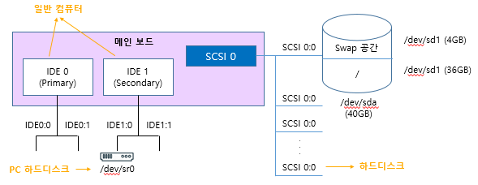
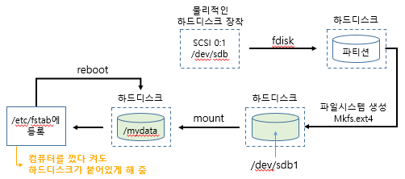

# Linux - 하드디스크 관리

> 사용한 리눅스 버전 : 15.5.1
>
> 책 - 이것이 리눅스다 with RedHat CentOS 8 (한빛미디어) 참고

### 하드디스크 1개 추가 

- 시스템의 하드디스크 공간이 부족할 때 가장 기본적으로 생각하는 방법은  하드디스크를 1개를 추가하는 것

1. IDE 장치와 SCSI 장치

    

   - IDE 0, IDE 1 슬롯 : 메인보드에 케이블을 곶을 수 있는 홈. 각각 2개의 IDE 장치를 장착할 수 있어 총 IDE 4개를 장착할 수 있음.
   - VMware는 일반적으로 IDE 1:0에 CD/DVD가 장착.
   - VMware는 메인보드에 4개의 SCSI 슬롯을 제공.
   - SCSI 0번 슬롯의 경우 SCSI 0:0 ~ SCSI 0:15(SCSI 0:7 제외)까지 15개의 하드디스크를 장착 가능.
     - 총 60(4X15)개의 SCSI 슬롯을 제공.
   - VMware에서 하드디스크는 Virtual Machine Settings에서 Add로 추가.

2. 하드디스크  장착(p338)

   - `파티션` : 하드디스크를 처음 장착하면 그냥 기계일 뿐이므로 하드디스크를 사용하기 위해선 파티션을 설정해야 함. 파티션은 Primary 파티션과 Extended 파티션 두 가지가 있으며 1개의 하드디스크는 4개의 Primary 파티션까지 설정할 수 있고 만약 5개 이상 설정하고 싶다면 3개의 Primary 파티션과 1개의 Extended 파티션으로 설정한 후 Extended 파티션을 2개 이상의 Logical 파티션으로 설정해야 함.

      

   1. SCSI 방식의 1GB 하드디스크 생성
      1. fdisk /dev/sdb : SCSI 0:1 하드디스크 선택. sdb 장치에 sdb1 파티션 생성

      - Command : n (new, 새로운 파티션 분할)
      - Select : p (Primary 파티션 선택)
      - Partition number : 1 (파티션 번호 1번 선택)
      - First sector : Enter (시작 섹터 번호 입력, 1개의 파티션만 계획 중이므로 첫 섹터로 설정)
      - Last sector : Enter  (마지막 섹터 번호 입력, 1개의 파티션만 계획 중이므로 마지막 섹터로 설정)
      - Command : p (설정된 내용 확인)
      - Command : w (설정 저장)

   - CentOS 리눅스에서 섹터 하나는 512바이트로 설정되어 있다. (512X209,7152=1,024MB)

   3. mkfs.ext4 /dev/sdb1 : 파일 시스템 생성 (=포맷)
   4. mkdir /mydata : 마운트할 /mydata 디렉터리를 생성
   5. cp anaconde-ks.cfg /mydata/test1 : 아무 데이터나 mydata에 복사(마운트가 일어나면 숨김 파일 처리됨)
   6. mount /dev/sdb1 /mydata : 포맷이 완료된 /dev/sdb1장치를 /mydata 디렉터리에 마운트
   7. unmount /dev/sdb1 : 마운트 해제

### 여러 개의 하드디스크를 하나처럼 사용

1. RAID

- 여러 개의 하드디스크를 하나의 하드디스크처럼 사용하는 방식. 
- 비용을 절감하면서도 신뢰성을 높이며 성능까지 향상시킴.
- 하드웨어 RAID : 하드웨어 제조업체에서 여러 개의 하드디스크를 연결한 장비를 만들어 그 자체를 공급하는 것.
- 소프트웨어 RAID : 고가 하드웨어 RAID의 대안으로 하드디스크만 여러 개 있어면 운영체제에서 지원하는 방식으로 RAID를 구성하는 방법.
- 신뢰성이나 속도 등이 떨어질 수 있으나 아주 저렴한 비용으로 좀 더 안전하게 데이터를 저장할 수 있음.

2. RAID 레벨

- 기본 구성방식 : Linear RAID, RAID 0, RAID 2, RAID3, RAID4, RAID5
- RAID 5의 변형 : RAID 6 
- 단순 볼륨 : 하드디스크 하나를 볼륨(=묶음) 하나로 사용하는 방법. RAID 방식에 미포함.
- Linear RAID : 2개 이상의 하드디스크를 1개의 볼륨으로 사용. 앞쪽 하드디스크에 데이터가 완전히 저장된 후 다음 하드디스크에 데이터를 저장.
  - 장점 : 하드디스크의 용량이 달라도 전체 용량을 문제 없이 사용할 수 있음. 공간 효율성 100%.
- RAID 0 :  2개 이상의 하드디스크를 1개의 볼륨으로 사용. 모든 하드디스크를 동시에 사용(=`스트라이핑 방식`).  중요도가 낮은 데이터에 사용.
  - 장점 : 시간, 속도, 성능, 공간 향상
  - 단점 : 하드디스크 중 하나가 고장 나면 데이터를 잃어버림

- RAID 1 : 똑같은 데이터의 거울을 만들어 놓는 것(=`미러링`). 데이터를 저장하는데 2배의 용량을 사용.  중요도가 높은 데이터에 사용.
  - 장점 : 하드디스크 중 하나가 고장 나도 데이터가 손상되지 않음.(=`결함 허용`을 제공)
  - 단점 : 하드디스크의 절반밖에 사용하지 못함. 공간 효율 50%.
- RAID 5 : 최소 3개 이상의 하드디스크가 있어야 구성할 수 있으며 대부분 5개 이상의 하드디스크로 구성. 하드디스크에 오류가 발생하면 `패리티`를 이용해서 데이터를 복구.
  - 장점 : 어느 정도의 결함을 허용하며 저장 공간 효율도 좋음.
  - 단점 : 2개의 하드디스크가 동시에 고장나면 데이터 복구가 어려움.
- RAID 6 : RAID 5의 방식이 개선된 것으로 2개의 패리티를 사용.
  - 장점 : 2개의 하드디스크가 동시에 고장나도 데이터에는 이상 없음.
  - 단점 : RAID 5보다 공간 효율이 약간 낮음.
- RAID 1+0 : RAID 1로 구성한 데이터를 다시 RAID 0으로 구성하는 방법. 신뢰성(안전성)과 성능(속도)을 동시에 확보 가능.

3. RAID 실습(p358)